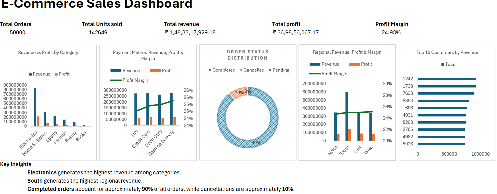

# E-Commerce Sales & Profitability Analysis

## Project Overview

This project analyzes e-commerce sales, revenue, profitability, customer behavior, product performance, payment methods, returns, cancellations, and data quality.

The project combines **MySQL, Python, Microsoft Excel, and Power BI** to perform data analysis and create business-focused insights and visualizations.

---

## Tools & Technologies

- **SQL (MySQL)** – Data analysis and business queries
- **Python** – Data cleaning, exploratory data analysis, and business insights
- **Microsoft Excel** – Data analysis and dashboard creation
- **Power BI** – Interactive dashboard and business visualization

---

## Project Workflow

**Data → Cleaning → SQL Analysis → Python EDA → Excel Analysis → Power BI Dashboard → Business Insights**

---

# Project Components

## 1. SQL Analysis

MySQL was used to analyze sales, profitability, customers, products, payments, orders, returns, cancellations, and data quality.

### Analysis Performed

1. Order status distribution
2. Master sales and profitability KPIs
3. Revenue and profit by category
4. Top 10 products by revenue
5. Top 10 products by profit
6. Top 10 customers by revenue
7. Monthly revenue trend
8. Payment method analysis
9. Return analysis
10. Cancellation rate
11. Repeat customer analysis
12. Invalid quantity analysis
13. Negative product margin analysis
14. Index optimization

---

## 2. Python Analysis

Python was used for data cleaning, exploratory data analysis, sales and profitability analysis, and identifying business insights.

### Analysis Performed

- Data cleaning and preparation
- Exploratory data analysis
- Sales analysis
- Revenue analysis
- Profitability analysis
- Product and category analysis
- Customer analysis
- Trend identification
- Business insight generation

### Python File

`ecommerce_sales_analysis.py`

---

## 3. Microsoft Excel Analysis

Microsoft Excel was used for sales and profitability analysis and dashboard visualization.

### Analysis Includes

- Sales analysis
- Revenue analysis
- Profit analysis
- Product performance
- Category performance
- Customer analysis
- Dashboard visualization

### Excel File

`E-Commerce Analysis.xlsx`

---

## 4. Power BI Dashboard

An interactive Power BI dashboard was created to provide a visual overview of e-commerce sales and profitability.

### Dashboard KPIs

| KPI | Value |
|---|---:|
| Total Orders | 50,000 |
| Total Units Sold | 1,426,549 |
| Total Revenue | ₹1,48,33,17,929.18 |
| Total Profit | ₹36,98,56,067.17 |
| Profit Margin | 24.93% |

### Dashboard Analysis

The Power BI dashboard analyzes:

- Sales and revenue
- Profitability
- Revenue and profit by category
- Payment method performance
- Order status distribution
- Regional revenue and profitability
- Top customers by revenue
- Business KPIs

### Power BI Report

`ecommerce_analytics_powerbi.pbix`

---

# Dashboard Preview

---

# Key Insights

The analysis focuses on:

- Overall sales and profitability performance
- Revenue and profit contribution by product category
- Top-performing products and customers
- Monthly revenue trends
- Payment method distribution
- Customer repeat-purchase behavior
- Return and cancellation patterns
- Data-quality issues such as invalid quantities and negative-margin products
- Product margin analysis
- SQL performance optimization

### Business Insights

- **Electronics** generates the highest revenue among the analyzed categories.
- **South** generates the highest regional revenue.
- **Completed orders** account for approximately 90% of orders, while cancellations account for approximately 10%.

---

## Project Files

| File | Description |
|---|---|
| [ecommerce_analysis.sql](./ecommerce_analysis.sql) | MySQL analysis queries |
| [ecommerce_sales_analysis.py](./ecommerce_sales_analysis.py) | Python data cleaning, EDA, and analysis |
| [E-Commerce Analysis.xlsx](./E-Commerce%20Analysis.xlsx) | Excel analysis and dashboard |
| [ecommerce_analytics_powerbi.pbix](./ecommerce_analytics_powerbi.pbix) | Power BI interactive dashboard |
| [dashboard.png](./dashboard.png) | Power BI dashboard preview |

---

# End-to-End Analysis

This project demonstrates an end-to-end data analysis workflow:

### 1. Data Preparation
Data was prepared for analysis and business reporting.

### 2. SQL Analysis
MySQL queries were used to analyze orders, revenue, profit, products, customers, payments, returns, cancellations, and data quality.

### 3. Python EDA
Python was used for data cleaning, exploratory analysis, trend identification, and business insights.

### 4. Excel Analysis
Excel was used for sales and profitability analysis and dashboard visualization.

### 5. Power BI Dashboard
Power BI was used to create an interactive dashboard containing KPIs, category analysis, regional analysis, payment analysis, order status, and customer performance.

### 6. Business Insights
The results were used to identify important patterns in sales, profitability, customers, products, regions, and order behavior.

---

# Conclusion

This project demonstrates practical experience with multiple data analysis tools and an end-to-end analytical workflow.

**Data → Cleaning → SQL Analysis → Python EDA → Excel Analysis → Power BI Dashboard → Business Insights**

The project covers:

- SQL analysis
- Python data analysis
- Excel analysis
- Power BI dashboard development
- Data cleaning
- Exploratory data analysis
- KPI analysis
- Data visualization
- Business insights
- Sales and profitability analysis
- Customer and product analysis
- Data quality analysis
